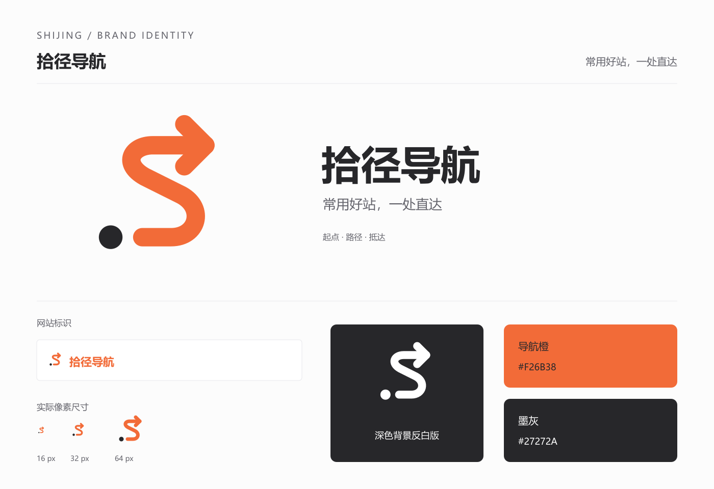

# 拾径导航品牌素材

## 定位与文案

网站名称、标题、描述、关键词和宣传短句统一以 [PRD 对外品牌](../PROJECT_REQUIREMENTS.md#21-对外品牌) 为准。

品牌素材采用手工 SVG 矢量设计，PNG 由本地 Sharp 渲染生成，没有调用 AI 图片生成服务。用户已反馈完成后台 PNG Logo 上传，浏览器图标统一由 `apps/web/src/app/favicon.ico` 提供，旧 `icon.tsx` 和根布局的后台 Logo 图标声明已移除。生产构建、部署和浏览器验收未执行。

## Logo 设计

圆点代表起点，S 形路径呼应“拾”的拼音首字母，箭头表达抵达所需网站。图形不含文字，配合现有 `SiteBrand` 独立呈现站点名称，避免名称重复和小尺寸中文模糊。

| 元素 | 规范 |
| --- | --- |
| 主色 | 导航橙 `#F26B38`，复用导航页 `--nav-orange` |
| 起点与横版文字 | 墨灰 `#27272A`，复用导航页 `--ink` |
| 反白版本 | 纯白 `#FFFFFF`，用于深色背景 |
| 图形母版 | `64 × 64` 坐标系，透明背景，纯路径与圆形，无外部资源或字体依赖 |
| 页面显示 | 沿用现有桌面 32px、手机 28px 图标区域，正方形等比缩放 |
| 使用限制 | 保留原始画布与留白，不拉伸、不加阴影、不在图标内部叠加文字 |

横版组合 PNG 用于外部展示，文字渲染使用本机 Microsoft YaHei；原始纯图形 SVG 与字体无关。16px 版本用于极小图标场景，主站标识优先使用 28px 及以上。



## 素材文件

| 文件 | 用途 |
| --- | --- |
| [logo.svg](assets/shijing-brand/logo.svg) | 唯一彩色矢量母版，可编辑和任意尺寸导出 |
| [logo-512.png](assets/shijing-brand/logo-512.png) | 512px 透明 PNG，后台上传推荐文件 |
| [logo-1024.png](assets/shijing-brand/logo-1024.png) | 1024px 透明 PNG，大尺寸展示 |
| [logo-64.png](assets/shijing-brand/logo-64.png) | 64px 透明 PNG |
| [logo-32.png](assets/shijing-brand/logo-32.png) | 32px 透明 PNG |
| [logo-16.png](assets/shijing-brand/logo-16.png) | 16px 透明 PNG |
| [favicon.ico](assets/shijing-brand/favicon.ico) | 包含 16、32、64px 三种尺寸的浏览器图标素材，应用副本位于 `apps/web/src/app/favicon.ico` |
| [logo-white.svg](assets/shijing-brand/logo-white.svg) | 派生反白矢量文件 |
| [logo-white-512.png](assets/shijing-brand/logo-white-512.png) | 512px 透明反白 PNG，适用于深色底图 |
| [logo-horizontal.png](assets/shijing-brand/logo-horizontal.png) | 960 × 240px 透明横版图文组合，勿上传到正方形站点 Logo 槽位 |
| [brand-preview.png](assets/shijing-brand/brand-preview.png) | 品牌组合、配色、反白及小尺寸预览 |
| [render.mjs](assets/shijing-brand/render.mjs) | 从彩色 SVG 母版重建派生素材 |

## 后台配置

1. 在目标环境进入 Admin 的“系统设置”（`/settings`），打开站点设置页签，确认当前身份具备站点设置更新权限。
2. 按 [PRD 对外品牌](../PROJECT_REQUIREMENTS.md#21-对外品牌) 填写站点名称、站点标题、站点关键词与站点描述，保存站点资料。宣传短句用于宣传物料，当前表单没有单独字段。
3. 在站点 LOGO 区域上传 `logo-512.png`。当前上传接口支持 PNG、JPEG、WebP，最大 2 MB，不支持 SVG 或 ICO；Logo 上传与资料保存为独立操作。
4. 刷新 Web，检查顶栏名称与 Logo、侧栏版权、页面标题及描述。运行中的站点配置由 Backend SiteProfile 提供，无需把品牌文案硬编码到页面。
5. 单独核对浏览器标签图标。`apps/web/src/app/favicon.ico` 由 Next.js 自动识别并通过 `/favicon.ico` 提供；更新该文件后重新构建和部署 Web。旧 `icon.tsx` 与根布局的 `icons.icon = site.logo_url` 声明已移除，后台 Logo 不再作为浏览器图标候选。顶栏仍由 `SiteBrand` 读取 `profile.logo_url`，更新后台 Logo 只影响页面内的品牌图片。浏览器实际显示尚未验收。

实际公开部署前仍需核对目标环境配置和页面显示。名称、商标和域名可用性未进行外部核验。

## 重新导出

在已安装项目 Web 依赖的仓库根目录执行：

```powershell
node docs/architecture/assets/shijing-brand/render.mjs
```

脚本使用现有 Next.js 依赖中的 Sharp，不安装或升级依赖，不启动浏览器或项目服务。只手工修改 `logo.svg`，然后重新导出派生文件；横版及预览中文渲染需要系统提供 Microsoft YaHei 字体。
