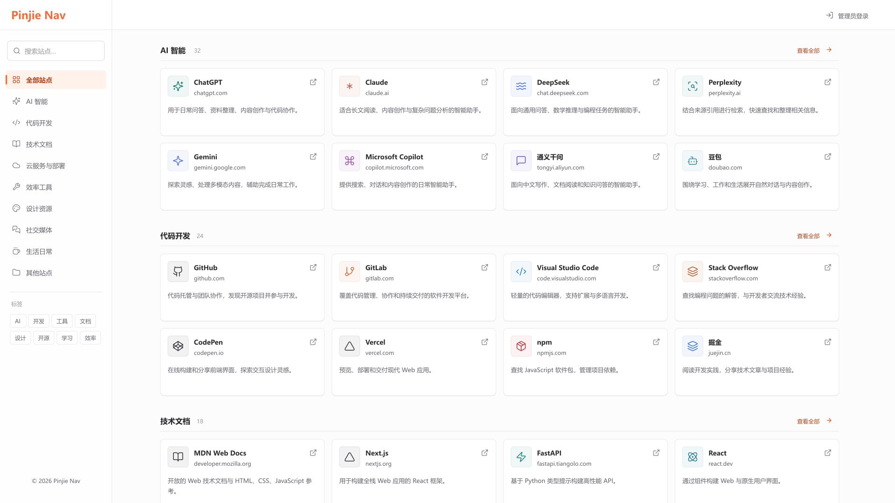
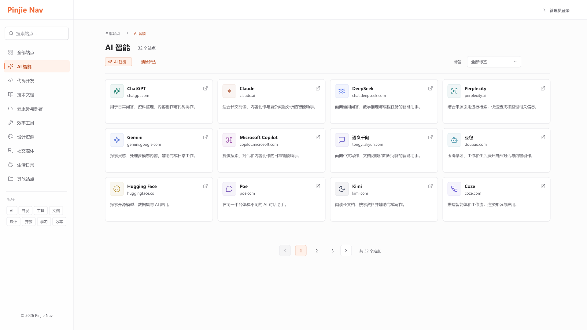
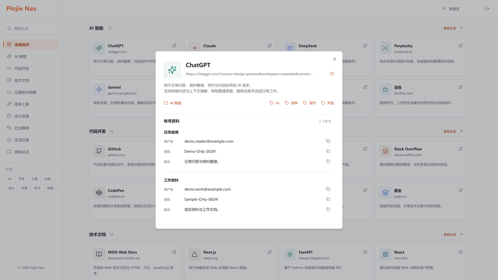
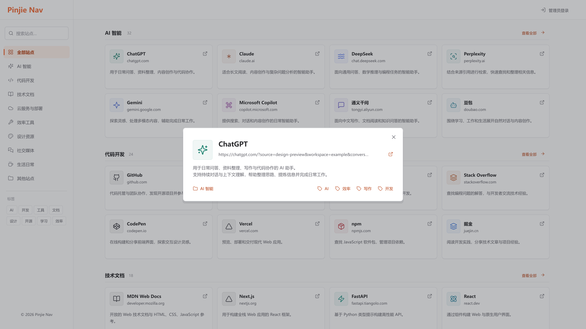
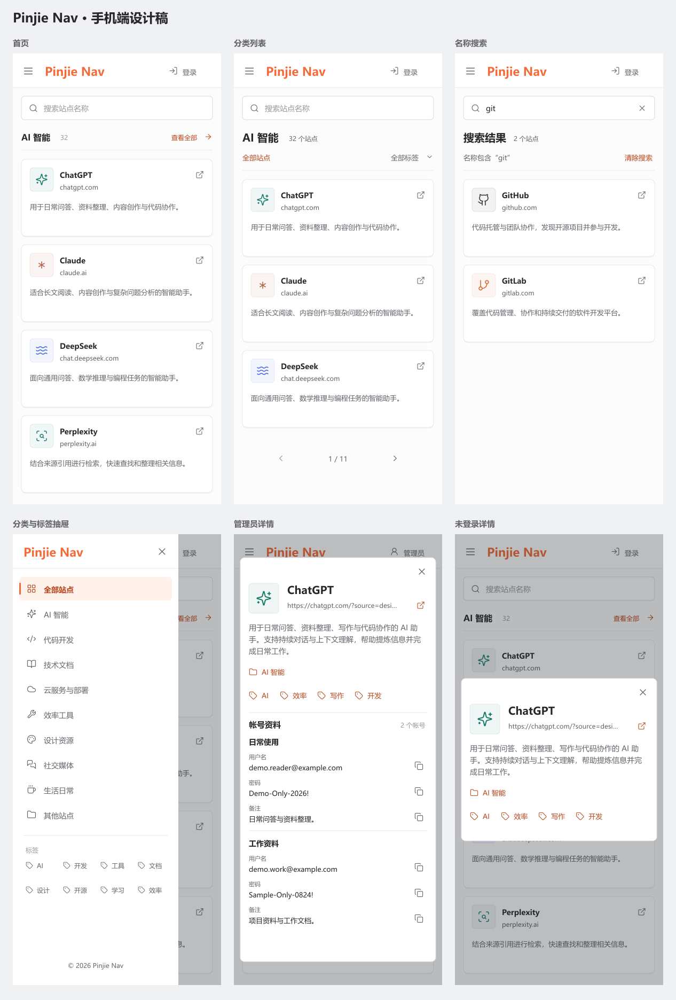
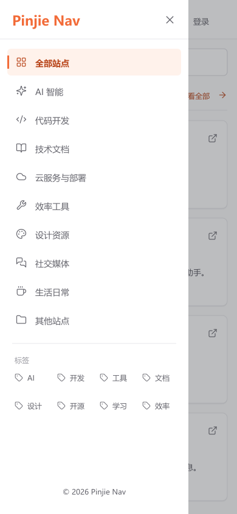
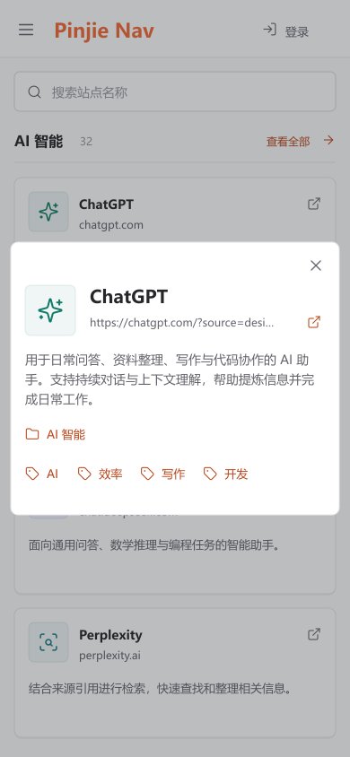

# Web 导航设计图 V1

本组 PNG 是首页、分类列表与站点详情的静态设计参考，不是真实页面截图或业务验收证据。相应应用源码已完成本地实现与轻量检查，浏览器视觉验收未执行。功能与视觉要求以 [Web 导航端设计标准](web-design-standard.md) 为准，决定和验证结果更新到 [原设计计划](../../plans/2026-09-07_Web导航视觉与详情设计计划.md)。

## 评审范围

- 画布为桌面 1920 × 1080，统一白底、橙色强调、240px 侧栏和四列站点卡片。
- 手机画布为 390 × 844，共六张：单列首页、分类列表、全站名称搜索、分类标签抽屉、管理员详情、未登录详情；另附总览图。
- 详情沿用弹窗形式，额外提供未登录状态以核对帐号区完整隐藏。
- 四张图的左侧栏底部均只居中显示 `© 2026 Pinjie Nav`，不显示“用户中心”和“系统状态”链接；正式版权名称消费站点配置。
- 站点名称和网址为展示样例，数量、分类、标签、简介及帐号资料为设计示例，不是数据库读取结果；帐号和密码全部虚构。
- 站点 LOGO 使用 Lucide 语义图标示意其位置和颜色，不代表相应品牌的官方 LOGO；实际实现应显示已有站点资产。
- 列表图示意 12 个站点和分页区，用于评审结构，不确定实际每页数量。当前源码每页 24 个的事实继续保留，实施时另行核对。
- 侧栏选中、标签、外链、复制和关闭图标仅为静态外观，PNG 不可交互。加载、错误及动态权限场景本轮未绘制或执行。

## 首页

按分类分组预览，每组最多 8 个，分类标题右侧为“查看全部”。首屏下方露出下一分类，提示页面可继续滚动。



## 分类列表

统一页面框架，内容区展示当前分类、计数、筛选条件、卡片列表与分页。标签列表复用这套框架并改为对应标签条件。



## 详情：管理员

左 LOGO，右侧名称和单行省略网址；描述在 LOGO 下方通栏展示，下一行分类靠左、全部标签靠右，两者统一使用无边框、无填色的紧凑图标文字链接。下方两条虚构帐号全部展开，用户名、密码、备注分别提供复制入口。图中网址的查询参数仅为演示省略效果的虚构样例，不代表站点真实功能。



## 详情：未登录

只保留上方资料及分类标签，没有帐号标题、登录提示、空态或帐号区占位。零帐号和确定无权限状态沿用这一结构。



## 手机端总览

搜索框直接可见；菜单展开分类与标签抽屉，底部只保留居中版权。仅在分类浏览状态保留标签选择，搜索结果不叠加分类或标签条件。无深色模式和置顶入口。



## 手机：首页与列表

首页向下滚动浏览同分类的其余预览项，仍遵守每组最多 8 个。分类图以三条卡片和分页演示结构，页大小与页数为排版样例，不构成接口分页调整。


## 手机：名称搜索与抽屉

示例输入 `git`，可命中 GitHub 和 GitLab，展示部分名称和大小写不敏感匹配。提交后搜索覆盖当前身份可见全站，清除原分类与标签；抽屉选择分类或标签后退出搜索。




## 手机：站点详情

网址单行省略，描述位于 LOGO 下方；分类独占一行，全部标签另起一行靠左排列，超宽时继续靠左换行，均与描述左边缘对齐。帐号字段纵向排列，复制图标独立；管理员内容超出可用高度时内部滚动。未登录弹窗按公开资料收紧高度，不留帐号区域。




## 生成与验证

使用本地 SVG 排版并通过已安装的 Sharp 输出 PNG，Lucide 图标通过现有 React 包渲染；未使用 AI 绘图 API，未增加依赖，设计图生成过程不启动应用或浏览器。生成脚本只服务于设计资产，不参与任何应用运行链。

从仓库根目录重新生成这组设计资产：

```powershell
node docs/architecture/assets/web-design-v1/render.mjs
```

脚本默认更新四张桌面 PNG、六张手机 PNG 和一张手机总览。添加 `--details-only` 仅更新两张桌面详情图，添加 `--mobile-only` 仅更新六张手机图和总览。V1 仅在设计修订时重绘；后续形成另一版方案时使用新的版本目录，便于比较。

已检查输出尺寸、像素非空，并逐张阅读中文、图标、间距和管理员与访客差异；这些检查只验证静态设计图，不证明应用布局、接口、点击、复制或权限机制已经实现。

## 下一步

1. 使用实际发布站点人工核对桌面与手机页面，对照本组设计图检查内容密度、长文本、分类标签和详情排列。
2. 核对外链、名称搜索、列表返回、帐号复制以及访客与管理员状态；自动化验证按项目授权策略单独执行。
3. 根据实际验收反馈更新源码与设计标准，需要调整静态参考时继续维护 V1。
