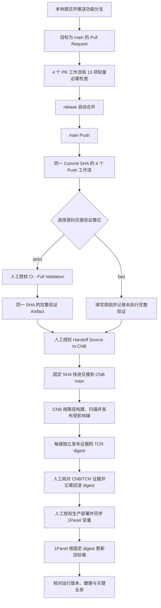

# GitHub Actions 工作流说明

## 1. 文档目标

本文说明仓库中每个 GitHub Actions 工作流的触发条件、执行步骤、作用、使用场景、失败含义和流程边界。

本文负责解释“GitHub 收到提交后会运行什么”以及各工作流内部机制。操作人员从 GitHub 点击运行到 1Panel 完成更新的实际顺序以[GitHub 到 1Panel 端到端人工发布手册](github-cnb-tcr-1panel-release-runbook.md)为准，发布和回滚决策以[发布与回滚手册](release-and-rollback.md)为准。

工作流配置是执行事实的最终来源：

| 工作流 | 配置文件 |
| --- | --- |
| CI - Governance | [ci-governance.yml](../../.github/workflows/ci-governance.yml) |
| CI - Backend | [ci-backend.yml](../../.github/workflows/ci-backend.yml) |
| CI - Frontend | [ci-frontend.yml](../../.github/workflows/ci-frontend.yml) |
| CI - Full Validation | [ci-e2e.yml](../../.github/workflows/ci-e2e.yml) |
| Security | [security.yml](../../.github/workflows/security.yml) |
| Handoff Source to CNB | [publish-images.yml](../../.github/workflows/publish-images.yml) |
| Deploy Production | [deploy-production.yml](../../.github/workflows/deploy-production.yml) |

## 2. 总体流程



流程坚持四项边界：

1. 功能分支 push 不运行整套检查；目标为 `main` 的 Pull Request 和 `main` push 触发轻量静态、契约、治理与安全检查，不运行应用测试或前端生产构建，不发布镜像，不接触生产服务器。
2. 完整验证只允许人工按需触发，不随 Push、Pull Request 或定时任务自动运行；它对输入 Commit SHA 执行 pytest、Vitest、production build 和 Chromium Playwright，并在全部成功后生成 30 天保留的 Artifact。
3. 源码交接必须人工触发，默认 `strict` 要求四个自动 Push 工作流和同 SHA 完整验证证据；显式 `fast` 仍要求四个自动 Push 工作流，并记录未执行完整验证的原因。CNB 只在受控 `main` Push 后构建并发布镜像。
4. 生产部署由维护者在 1Panel 人工执行，固定三个已经核验的镜像 digest；当前流程不使用候选镜像验收工作流。纯文档且无运行影响的提交完成 Git 交付即可，不需要继续源码交接和部署。

## 3. 触发条件总表

| 工作流 | Push | Pull Request | 定时 | 人工触发 |
| --- | --- | --- | --- | --- |
| CI - Governance | 仅 `main` | 仅目标为 `main` | 否 | 否 |
| CI - Backend | 仅 `main` | 仅目标为 `main` | 否 | 否 |
| CI - Frontend | 仅 `main` | 仅目标为 `main` | 否 | 否 |
| CI - Full Validation | 否 | 否 | 否 | 是 |
| Security | 仅 `main` | 仅目标为 `main` | 每周一次 | 否 |
| Handoff Source to CNB | 否 | 否 | 否 | 是 |
| Deploy Production | 否 | 否 | 否 | 是 |

四个自动工作流统一限制为目标为 `main` 的 Pull Request 和 push 到 `main`。功能分支 push 不再重复运行整套检查；PR 在合并前运行轻量门禁，合并后的 `main` push 再为精确 Commit SHA 生成镜像发布所需的四项成功记录。当前未配置路径过滤，也不自动运行 Backend pytest、前端 Vitest、前端 production build 或 Playwright。

`CI - Full Validation` 只支持从 GitHub Actions 页面人工触发，必须从默认分支选择工作流并输入属于默认分支历史的完整 40 位 Commit SHA。普通开发和 Git 交付不自动运行它；`Handoff Source to CNB` 的 `strict` 模式要求同一 SHA 的成功 Artifact，`fast` 模式会明确记录该验证未执行或未作为门禁。

`Security` 的定时表达式是 `23 3 * * 1`，即每周一 `03:23 UTC`。在中国标准时间下对应每周一 `11:23`。

`git push` 只上传已经提交的 Git 对象。本地未提交修改和未跟踪文件不会进入 GitHub，也不会被对应 Actions Run 检查。

### 3.1 远端仓库治理基线

截至 2026-09-07，Nav 仓库 `jinmozhe/pinjie-fullstack-nav` 的已核验配置如下：

- Dependabot vulnerability alerts 与 Dependency graph 已启用，依赖比较接口可用；Secret Scanning 和 Push Protection 已启用。Dependabot security updates 保持关闭。
- active Ruleset `Nav main pull request and light checks`（ID `22393975`）仅作用于 `refs/heads/main`，禁止删除和非快进更新，要求线性历史、Pull Request、会话解决和 13 项现有轻量检查。
- 必需检查绑定 GitHub Actions（App ID `15368`），采用严格分支更新检查；具体名称以本节下方工作流检查表和远端 Ruleset 为准。
- Ruleset 审批数为 0，不要求第二维护者批准，bypass 列表为空；PR 仅允许 rebase 合并。仓库启用 Auto-merge 和合并后自动删除功能分支。
- 母版的漏洞编号、风险接受结果、Ruleset ID、Actions 权限设置和生产 Environment 不能作为 Nav 配置事实；生产发布环境仍需独立配置和核验。

Dependency review 报告依赖图不可用时，应先检查仓库安全设置。GitHub 会在启用 Dependabot 时自动启用依赖图，见[官方 Dependabot 入门说明](https://docs.github.com/en/code-security/tutorials/secure-your-dependencies/dependabot-quickstart)。不得通过跳过依赖审查解决配置缺失。

单维护者基线没有独立审批职责分离，但 Pull Request 和自动检查仍是默认分支的强制门禁。
普通提交、分支推送和合并按用户文字分别授权。用户显式调用 `$git-sync` 时，该次调用覆盖当前任务的分支、提交、推送、PR、rebase 自动合并、分支清理和本地 `main` 同步；镜像发布和生产部署继续分别取得明确授权，并保留不可变发布和审计记录。

### 3.2 项目 Node.js 与 Action 运行时

工作流中 `actions/setup-node` 的 `node-version: "24"` 管理后续 `pnpm`、构建、测试和仓库脚本
使用的项目 Node.js。它不会改变其他 JavaScript Action 自身的运行时。

JavaScript Action 的执行版本由该 Action 固定提交中的 `action.yml` 或 `action.yaml` 的
`runs.using` 声明。仓库不能在调用方工作流中省略或改写这个值；只删除版本注释也不会改变
实际运行时。截至 2026-08-22，七个工作流直接引用的 JavaScript Action 均已升级到原生
`node24` 的正式版本并固定完整 Commit SHA，其余直接 Action 为 Composite 或 Docker Action。
仓库不设置 `ACTIONS_ALLOW_USE_UNSECURE_NODE_VERSION`，也不依赖 GitHub Runner 将旧
`node20` Action 兼容覆盖到 Node.js 24。

## 4. Pull Request 与 main Push 的执行顺序

GitHub 收到目标为 `main` 的 Pull Request 更新或 `main` 新提交后，会为对应 Commit SHA 创建四个相互独立的 Workflow Run：

1. `CI - Governance`
2. `CI - Backend`
3. `CI - Frontend`
4. `Security`

四个工作流通常并行排队和执行。它们之间没有 `workflow_run` 自动串联，因此一个工作流成功不会自动启动另一个工作流。

同一工作流内部可以通过 `needs` 建立 Job 依赖。例如 Backend 和 Frontend 先判断应用状态，再决定是否运行对应轻量质量检查。GitHub Runner 配额和依赖下载速度会影响完成先后顺序。

任意工作流失败时：

- 该 Commit SHA 的整体检查状态会出现失败。
- GitHub 可能按个人通知设置发送 Actions 失败邮件。
- 其他已经开始的工作流通常继续运行。
- `Handoff Source to CNB` 会拒绝使用该 Commit SHA，因为两种模式都要求四个自动 Push 工作流成功；`strict` 还要求同 SHA 完整验证 Artifact。
- 不会自动回退本地代码，也不会自动修改远程分支。

人工完整验证失败或 Artifact 缺失、过期时，该 Commit SHA 不能通过 `strict` 模式。修复代码后应对新的 Commit SHA 重新运行；仅因 Artifact 过期时，可以在默认分支上对同一 SHA 重新人工触发完整验证。只有操作人员完成风险判断并明确接受未运行 pytest、Vitest、production build 和 Playwright 的风险时，才能改用有原因记录的 `fast` 模式。

## 5. CI - Governance

### 5.1 作用和使用场景

Governance 检查仓库结构、文本质量和架构边界，防止代码本身能编译，但仓库已经出现不完整应用、错误编码、生成缓存入库或跨模块非法依赖。

适用场景包括：

- 修改任何源码、配置或文档后验证文本卫生。
- 新增目录、应用入口、依赖或共享包后验证工作区状态。
- 调整 Backend 领域或 Frontend Feature 后验证模块边界。
- 修改治理脚本后运行正反例，确认门禁能够正确放行和拒绝。

### 5.2 执行步骤

| 步骤 | 作用 | 典型失败原因 |
| --- | --- | --- |
| Checkout repository | 检出目标提交 | Action 或 GitHub 基础设施异常 |
| Validate text assets | 检查 UTF-8、BOM、末尾换行和受控文件类型 | 乱码、UTF-8 BOM、缺少末尾换行 |
| Validate workspace state | 判断 Backend、Web、Admin 是 `empty`、`partial` 或 `ready` | 应用只有部分入口、脚本或配置 |
| Validate module boundaries | 检查跨应用和模块内部依赖 | 应用互相直接引用、领域越界导入 |
| Test governance guards | 用正反例验证治理脚本本身 | 门禁未拒绝反例、清理或退出码错误 |
| Install pnpm and Node.js | 安装固定 pnpm 11.17.0 和 Node.js 24 | 下载失败、缓存或运行环境异常 |
| Install locked dependencies | 按锁文件安装依赖 | 锁文件漂移、供应链策略拒绝依赖 |
| Lint Markdown | 运行全仓库 Markdown 格式检查 | 标题、列表、表格或链接格式违规 |

### 5.3 结果含义

成功表示仓库治理规则通过，不等于 Backend、Frontend 或真实业务流程已经通过。应用质量和端到端行为由其他工作流负责。

## 6. CI - Backend

### 6.1 作用和使用场景

Backend 工作流验证 FastAPI 应用的静态质量、模块边界、源码编译、应用导入和 OpenAPI 生成契约。它不启动 PostgreSQL 或 Redis，也不运行 Alembic 数据库验证和 pytest。

适用场景包括：

- 修改 Python 业务代码、配置、依赖或测试。
- 修改 SQLAlchemy Model 或 Alembic 迁移时检查源码、导入和文件边界；真实数据库验证需要用户明确授权后在本地执行。
- 修改 Router、Schema 或 OpenAPI 契约。
- 修改共享 API Client 的生成来源。

### 6.2 Backend state and boundaries

第一个 Job 运行工作区状态和模块边界检查，并输出 Backend 状态：

- `empty`：明确的空骨架，只报告状态，不宣称应用质量通过。
- `ready`：入口、依赖、测试和必要配置完整，继续运行 `backend-quality`。
- `partial`：部分实现状态，工作区门禁直接失败。

当前 Backend 为 `ready`，因此目标为 `main` 的 PR 和 `main` push 都会进入轻量质量检查。

### 6.3 Backend quality

Job 不启动测试服务容器，全部步骤应在没有 PostgreSQL、Redis 和测试数据库的条件下完成。

| 步骤 | 作用 |
| --- | --- |
| 安装 uv 和 CPython 3.14 | 建立固定 Python 运行环境 |
| `uv sync --locked` | 按 `uv.lock` 安装精确依赖，拒绝锁文件漂移 |
| Python 版本断言 | 确认实际运行 CPython 3.14 |
| Ruff | 检查 Python 代码质量和导入顺序 |
| Ruff format | 检查格式，无自动改写 |
| Mypy | 运行严格静态类型检查 |
| Import boundaries | 检查 Backend 模块依赖规则 |
| Compile Python sources | 编译应用、迁移和脚本源码 |
| Import application | 导入 FastAPI 应用并生成内存 OpenAPI |
| Export OpenAPI contract | 从 Backend 重新生成根 `openapi.json` |
| Regenerate API Client | 从 OpenAPI 重新生成 TypeScript Client |
| Reject generated contract drift | 发现生成结果与仓库不一致时失败 |

### 6.4 Pull Request 专属检查

`OpenAPI breaking changes` Job 只在 Pull Request 运行。它比较 PR 与目标分支的 `openapi.json`，使用 `oasdiff` 拒绝未处理的破坏性接口变化。

普通 push 不运行该 Job，因为 push 事件没有 PR 的目标分支上下文。

## 7. CI - Frontend

### 7.1 作用和使用场景

Frontend 工作流分别验证 Web 和 Admin 两个独立应用，只覆盖 ESLint 与 TypeScript 类型检查。单元或组件测试、生产构建和浏览器验证不由 Push 或 Pull Request 自动执行。

适用场景包括：

- 修改 Next.js Web 应用。
- 修改 Umi Max、React、Ant Design Admin 应用。
- 修改共享前端包或根依赖。
- OpenAPI 变化后验证两个消费者仍能通过类型检查。

### 7.2 Frontend state and boundaries

第一个 Job 检查工作区状态和模块边界，分别输出 `web` 与 `admin` 状态。`ready` 应用进入对应质量 Job，`partial` 状态导致门禁失败。

Web 和 Admin 当前均为 `ready`，两个质量 Job 可以并行执行。

### 7.3 Web quality

1. 安装固定 pnpm 11.17.0 和 Node.js 24。
2. 使用 `pnpm install --frozen-lockfile` 安装锁定依赖。
3. 运行 Web ESLint。
4. 运行 Web TypeScript 类型检查。

### 7.4 Admin quality

1. 安装固定 pnpm 11.17.0 和 Node.js 24。
2. 使用 `pnpm install --frozen-lockfile` 安装锁定依赖。
3. 运行 Admin ESLint。
4. 运行 Admin TypeScript 类型检查。

### 7.5 结果含义

成功只表示两个前端应用通过各自的 ESLint 和 TypeScript 类型检查，不表示 Vitest、production build 或浏览器流程通过。只有用户明确授权时才在本地运行对应重型命令，线上完整验证也由用户人工触发。

## 8. CI - Full Validation

### 8.1 作用和使用场景

完整验证只支持 `workflow_dispatch` 人工触发。操作人员必须从默认分支启动工作流并输入待验证的完整 Commit SHA；工作流会确认 SHA 属于默认分支历史，然后在 Ubuntu Runner 中执行 Backend pytest、Admin/Web Vitest、两端 production build 和 Chromium 跨栈 E2E。

完整验证环境同时允许 `127.0.0.1` 与 `localhost` 两组 Web/Admin 测试 Origin。真实服务和 Playwright 使用 `127.0.0.1`，Backend 既有 API 测试夹具使用 `localhost`；两组仅用于隔离 Runner 的本机回环地址，不能扩展为通配 Origin。

受控启动器等待 Web 服务返回 2xx，并且只在 Admin `/umi.js` 返回 JavaScript Content-Type 后放行 Playwright，避免 Umi 首次编译期间的 2xx HTML 回退页被误判为应用就绪。

它主要发现单元测试难以覆盖的问题：

- Backend 与数据库或 Redis 的真实连接问题。
- Cookie、CSRF、跨应用认证和同域代理问题。
- OpenAPI Client 与真实 HTTP 响应不一致。
- 页面路由、表单、权限导航和浏览器运行错误。
- 多个应用分别构建成功，但组合运行失败。

本地重型命令和线上完整验证都只在用户明确授权时运行。需要排除 Windows、本机缓存或本地服务差异，或准备镜像发布证据时，可以由用户人工触发该工作流获得干净 Ubuntu 环境的结果。它不参与 Pull Request 或 Push 门禁，也不会自动触发镜像发布；成功 Artifact 只作为后续独立授权的 `Handoff Source to CNB` 输入证据。

### 8.2 执行步骤

1. 校验输入 SHA 格式、工作流分支、检出结果和默认分支祖先关系。
2. Backend Job 启动独立 PostgreSQL 18.4、Redis 8.10.0，使用固定 uv `0.11.32` 与 CPython 3.14 同步依赖、迁移并执行 90% 覆盖率门禁的 pytest。
3. 与 Backend 并行的 Admin、Web 矩阵 Job 各自安装固定 pnpm 11.17.0、Node.js 24 和锁定依赖，执行 80% 覆盖率门禁的 Vitest，再构建并上传生产产物。
4. 三端成功后，E2E Job 在自己的独立数据库中准备权限、注册设置和管理员，启动 Uvicorn，并下载同一 Run 的前端产物。
5. 安装 Chromium，执行 `pnpm test:e2e`。Web 运行 standalone，Admin 用固定 Nginx 镜像挂载 dist 和生产 nginx.conf，端口已占用时拒绝复用未知服务。
6. 全部成功后上传 `full-validation-<完整 SHA>`，内容为 `pinjie-full-validation-v2`，保留 30 天；旧 v1 不再作为修正后的生产产物证明。
7. 成功或失败均保留可用的阶段耗时、退出码与脱敏浏览器结果 14 天。前端传递产物保留 3 天，CI 不上传会话、Trace、Video、HTML 或原始服务日志。

### 8.3 资源特征

该工作流会下载浏览器、启动数据库和 Redis，并运行三端重型测试与两个前端构建，耗时和资源占用较高，因此只能在用户明确授权后人工触发。任一步失败都不会上传成功证据；Artifact 过期后必须重新运行完整验证，不能通过修改输入或文本说明绕过。

### 8.4 交接证据与 Nav 范围

Nav 未接入母版可选的候选镜像组合验收工作流与工具。既有发布配置仍含母版 CNB/TCR 模板，启用前必须按独立 Nav 环境核对并适配；本手册描述继承的操作机制，不证明发布环境已就绪。

Handoff 使用 `cnb-source-handoff-main` 统一串行组，避免两个不同 SHA 同时推进同一 CNB 分支；GitHub concurrency 不承诺 FIFO，尚在等待的运行可能被更新的等待项替换，操作人员应核对最终 Run 状态。交接成功后保存模式、快速模式理由、Full Validation Run、目标 SHA 和 attempt 的结构化 Artifact。

## 9. Security

### 9.1 作用和使用场景

Security 工作流覆盖密钥泄露、依赖漏洞、依赖变更和源码安全问题。它在目标为 `main` 的 Pull Request、`main` push 和每周定时任务中运行，使没有新提交时出现的最新漏洞公告也能被发现。

### 9.2 Source state

运行工作区完整性检查，避免在应用处于不完整状态时把安全检查结果误表述为完整应用已经通过安全验证。

### 9.3 Gitleaks Secret scan

Gitleaks 使用完整 Git 历史检查密码、API Key、Token、私钥和其他高风险秘密。

适用场景：

- 开发者误提交真实 `.env`。
- 测试代码中写入真实云服务或支付密钥。
- 当前文件已删除密钥，但历史提交仍保留原文。

发现真实秘密后，必须先吊销或轮换对应凭据，再处理 Git 历史和扫描结果。只删除当前文件不能消除已经泄露的凭据风险。

### 9.4 Dependency review

该 Job 只在 Pull Request 运行，比较基础分支和 PR 之间的依赖变化，并拒绝新引入的高危依赖。

它回答的问题是“这次 PR 新增或升级的依赖带来了什么风险”，普通 push 和定时任务没有对应的 PR 差异，因此跳过。

### 9.5 Trivy Dependency vulnerability scan

Trivy 以文件系统模式扫描依赖清单和锁文件，检查 Python、Node.js 等生态中已经公开的已知漏洞。

当前门禁：

- 只把 `HIGH` 和 `CRITICAL` 作为阻断等级。
- 发现阻断漏洞时退出码为 1。
- 使用 `ignore-unfixed: true` 忽略尚无可用修复版本的漏洞。

适用场景包括新披露的 CVE/GHSA、锁文件中仍固定旧版本以及间接依赖带来的漏洞。

### 9.6 pnpm audit

`pnpm audit` 专门检查 pnpm/npm 生态的已知安全公告。当前使用 npm Registry，并通过 `--audit-level high` 阻断高危和严重漏洞。

它与 Trivy 的 Node.js 检查存在部分覆盖，但解析方式和数据来源链路不完全相同。双重检查用于降低单一工具遗漏风险。

### 9.7 Semgrep CE SAST

Semgrep 检查仓库自己编写的 Python、JavaScript、TypeScript、Shell、YAML 和其他受支持源码或配置，覆盖命令注入、危险 API、不安全数据流和 CI 配置风险。

当前配置：

```text
semgrep scan --config p/default --error --strict --metrics off --verbose
```

参数含义：

- `p/default`：使用 Semgrep Registry 的默认社区规则集。
- `--error`：发现规则命中时返回失败退出码。
- `--strict`：规则、解析警告和内部错误同样失败关闭。
- `--metrics off`：关闭使用指标上报。
- `--verbose`：在日志中显示解析警告的位置和规则，避免只有失败退出码而无法定位。

CI 固定安装 Semgrep CE `1.173.0`，不配置 Semgrep Token，不创建云端项目，也不上传源码或扫描结果。

### 9.8 Security 失败如何判断

| 失败 Job | 优先检查 |
| --- | --- |
| Source state | 应用是否进入 `partial`，入口、脚本和测试是否完整 |
| Secret scan | 命中内容是否是真实密钥，是否需要立即轮换 |
| Dependency review | PR 是否新引入高危依赖 |
| Dependency vulnerability scan | Trivy 报告的包、版本、严重度和可修复版本 |
| Node dependency audit | pnpm 报告的直接或间接依赖链 |
| Semgrep CE SAST | 规则 ID、文件、行号、数据流和修复建议 |

依赖安装还执行仓库级供应链策略：uv 和 pnpm 对新发布版本设置七天冷却期，pnpm 拒绝奇异传递依赖和包信任等级降级。历史信任问题只允许精确包版本例外；新依赖、升级解析或现有锁文件违反策略时会在安装阶段失败。

扫描器发现问题和扫描器自身故障都可能使 Job 失败。判断时先看具体 Job 和第一条有效错误，不能只根据 `Security failed` 邮件标题推断原因。

## 10. Pull Request 流程差异

Pull Request 会运行同样的四个自动工作流，并额外启用两项差异检查：

1. Backend 的 `OpenAPI breaking changes` 比较目标分支与 PR 契约。
2. Security 的 `Dependency review` 检查 PR 新增或改变的依赖。

Pull Request 检查用于合并前评审。`main` push 检查用于验证已经进入默认分支的精确 Commit SHA。镜像发布要求的是同一 Commit SHA 的成功 `push` Run，PR Run 不能替代。

## 11. Handoff Source to CNB 与 CNB 发布

### 11.1 作用和使用场景

`Handoff Source to CNB` 校验一个已经通过四个自动门禁的 Commit SHA，按人工选择执行 `strict` 或 `fast` 验证模式，然后把该提交以非强制、只能快进的方式交接到 CNB `main`。GitHub Runner 不构建或上传生产镜像层；CNB 接收 Push 后通过根目录 `.cnb.yml` 按真实构建输入选择 Backend、Web 和 Admin Pipeline，完成单镜像扫描和证据生成后只发布到腾讯云 TCR 个人版。

典型使用场景：

- 准备正式部署某个已经审核的 `main` 提交。
- 在腾讯侧生成可追溯生产镜像，减少跨境镜像层上传。
- 为后续部署和回滚保留经过扫描和证明的 TCR digest。

GitHub 工作流只支持 `workflow_dispatch` 人工触发。执行前必须取得独立的源码交接和镜像发布授权，输入完整 40 位小写 Commit SHA，并选择验证模式。`strict` 是默认值；`fast` 只用于已人工确认的低风险变化，必须填写不含密钥或敏感数据的单行原因。GitHub Run 成功只证明源码交接完成；镜像发布结果以随后触发的 CNB Pipeline 为准。

### 11.2 Validate immutable input

发布前验证包括：

1. Commit SHA 必须匹配 40 位小写十六进制格式。
2. 工作流必须从仓库默认分支启动。
3. 检出的 `HEAD` 必须与输入 SHA 完全一致。
4. 目标提交必须属于仓库默认分支历史。
5. 同一 SHA 必须存在以下四个成功、已完成的 Push Run：
   - `CI - Governance`
   - `CI - Backend`
   - `CI - Frontend`
   - `Security`
6. `validation_mode` 只能为默认的 `strict` 或显式选择的 `fast`。
7. `strict` 要求 GitHub Actions 存在名称为 `full-validation-<完整 SHA>` 且未过期的 Artifact。
8. `strict` 要求 Artifact 所属 Run 由默认分支通过 `workflow_dispatch` 启动，工作流路径为 `.github/workflows/ci-e2e.yml`，结论为成功。
9. `strict` 要求 Artifact 内容中的 Commit SHA、Workflow Run ID、pytest、Vitest、production build、Chromium Playwright、PostgreSQL 和 Redis 字段全部匹配。
10. `fast` 要求 `fast_mode_reason` 为非空单行文本且不超过 200 个字符，并在 Summary 中记录操作者、Commit、模式、跳过事实和原因。
11. Backend、Web 和 Admin 状态必须全部为 `ready`。
12. 模块边界必须再次通过。

任何适用项缺少时，工作流在向 CNB 写入前停止。四个 Push Run 继续只代表轻量门禁和安全检查；`strict` 的重型验证由同 SHA Artifact 证明，`fast` 明确表示未取得该证明。CNB 中的 Docker build 只负责生成制品，不能替代 pytest、Vitest 或 Playwright。

### 11.3 GitHub 源码交接

验证通过后，`handoff` Job 绑定 `cnb-source-handoff` Environment，并执行：

1. 再次检出和核对批准的 Commit SHA。
2. 校验 CNB 仓库 URL 固定为 `https://cnb.cool/pjwl/pinjie-fullstack-base`，目标分支固定为 `main`，HTTPS 用户名固定为 `cnb`，Token 非空。
3. 使用临时 `GIT_ASKPASS` 读取 Token，不把凭证写入远程 URL、Git 配置或日志。
4. 查询 CNB `main`。仓库为空时允许首次创建；已有分支时要求远端 SHA 是目标 SHA 的祖先。
5. 执行普通 Git Push，禁止强制推送；写后再次查询 CNB `main` 并要求等于批准 SHA。

### 11.4 CNB 构建与候选发布

CNB `.cnb.yml` 声明三个具名 `main.push` Pipeline，并提供受控的 `main.web_trigger_full_release` 人工全量入口。每条 Pipeline 使用 4 核 Linux AMD64 社区构建节点、固定 digest 的构建环境、独立 Docker 配置目录和按应用划分的 TCR 发布锁。CNB 密钥仓库文件只允许 `pjwl/pinjie-fullstack-base` 的 `main` Push 与 `web_trigger_full_release` 引用，并提供 TCR Registry 登录所需参数。

三条 Pipeline 可以并行运行，每条只处理一个固定应用，并使用该应用自己的 TCR Registry 缓存：

| 应用 | Dockerfile | TCR 镜像名 |
| --- | --- | --- |
| Backend | `apps/backend/Dockerfile` | `pinjie-fullstack-backend` |
| Web | `apps/web/Dockerfile` | `pinjie-fullstack-web` |
| Admin | `apps/admin/Dockerfile` | `pinjie-fullstack-admin` |

每个应用执行：

1. 以仓库根目录为上下文，使用固定 `IMAGE_KEY` 映射的 Dockerfile 构建 `linux/amd64` 镜像，拒绝未知应用键和任意路径输入。
2. 从 `CNB_COMMIT` 读取 Git committer time，设置 `SOURCE_DATE_EPOCH`，并写入 OCI `revision`、`created` 与 `source` 标签；同一 Commit 重建保持相同创建时间。该时间会随 Commit 变化，跨 Commit 的部分 COPY 层可能重新构建。
3. 从 `buildcache-main` 读取并写回 Registry 缓存；缓存标签明确属于可变构建缓存，不可用于部署。
4. 使用 CNB 默认 Buildx `docker` 驱动向 TCR 推送 `candidate-<CNB Build ID>` 唯一候选标签；构建前要求该标签不存在，避免覆盖其他运行的候选内容。
5. 从 Buildx metadata 读取输出 digest，依次核对候选标签 digest 和按 digest 查询的 TCR OCI index；index 必须包含 attestation manifest，metadata 中的 provenance 和输出 digest 必须匹配。
6. 使用固定 digest 的 Trivy 扫描候选镜像；High、Critical 且已有修复的漏洞使发布失败。失败时在日志输出镜像引用、包名、CVE、已安装版本和修复版本，并保存包含原始 JSON、digest、metadata 和精简摘要的失败附件。
7. 为每个候选生成 CycloneDX JSON SBOM。

### 11.5 Finalize 与单镜像发布证据

每条 Pipeline 在自己的候选镜像通过后独立执行：

1. 检查对应 TCR 仓库的 `sha-<完整 Commit SHA>` 目标是否冲突。
2. 标签不存在时从精确候选 digest 创建，已经指向同一 digest 时允许幂等通过，指向不同 digest 时失败。
3. 标签写入后重新查询并核对 digest。
4. 生成并严格校验 `pinjie-cnb-tcr-image-v1` JSON 清单，字段包含应用键、Commit SHA、Git Commit 时间、CNB Pipeline、Build ID、Build URL、完整 TCR digest、扫描、SBOM、provenance 和 OCI 标签。
5. 将该端发布清单、Trivy JSON、CycloneDX SBOM、Buildx metadata、OCI index 和镜像配置打包为当前 Pipeline 附件；失败附件也只包含当前应用的证据。
6. Pipeline 结束时删除该应用的临时 Docker 登录配置。

Pipeline 不创建 `latest` 或分支标签。`candidate-<CNB Build ID>` 标签是唯一、可追溯的运行候选，禁止部署。只影响一个应用时，该端完整 Pipeline 和单镜像清单通过后即可进入该端部署授权。同一 Commit 影响多个应用时，操作人员必须等待预期 Pipeline 全部成功，并核对各清单的 Commit SHA 完全一致；任一端失败、缺失或被错误跳过都阻止该 Commit 部署。生产仍按完整 digest 部署，不读取缓存标签、候选标签或以 SHA 标签代替 digest。

### 11.6 路径选择与人工全量入口

- `apps/backend/**` 只触发 Backend。
- `apps/web/**` 触发 Web，其中 `apps/web/package.json` 同时触发 Admin。
- `apps/admin/**` 触发 Admin，其中 `apps/admin/package.json` 同时触发 Web。
- 根依赖文件、`packages/**` 和 `patches/**` 同时触发 Web 与 Admin。
- `.dockerignore`、`.cnb.yml` 和 CNB 发布与证据脚本触发三端。
- `compose.prod.yml`、`docs/**` 和 `plans/**` 不触发镜像构建。

CNB 对变更文件的统计上限是 300 个，新分支 Push 也无法比较上一 Commit。首次运行、超过上限、Git 历史无法比较或影响范围存疑时，在 CNB `main` 分支详情页使用“三端全量镜像构建”按钮。按钮触发 `web_trigger_full_release`，不接受用户输入的分支、Commit 或镜像名。

### 11.7 权限

GitHub 验证 Job 只读取 Actions 和仓库内容。`handoff` Job 仅获得仓库读取权限并绑定 `cnb-source-handoff` Environment，该 Environment 只允许默认分支；CNB Token 只具备目标私有仓库 `repo-code:rw`。CNB 的 TCR 用户名和固定密码只从受限密钥仓库导入，密钥文件限制目标仓库、`main` 分支和 Push 事件。GitHub 不保存 TCR 发布密码，CNB 不保存 GitHub Token，生产服务器后续只保存独立只读 TCR 凭证。

## 12. Deploy Production

本节记录仓库中保留的旧 GHCR 自动部署工作流。当前生产链路使用 CNB、TCR 和 1Panel 人工更新，该工作流必须保持禁用。现行操作步骤见[GitHub 到 1Panel 端到端人工发布手册](github-cnb-tcr-1panel-release-runbook.md)。

### 12.1 作用和使用场景

`Deploy Production` 将已经发布并验证的三个镜像 digest 部署到生产服务器。它不重新构建源码，也不自动选择最新镜像。

当前工作流仍登录 GHCR、核验 GHCR `sha-<commit>` 标签并部署 GHCR digest，与人工使用 CNB 发布清单和 TCR digest 的现行生产路径不一致。完成独立的 TCR 自动部署改造和授权前，GitHub `production` Environment 的 `PRODUCTION_DEPLOYMENT_ENABLED` 必须保持 `false`，禁止触发该工作流执行生产部署。

典型使用场景：

- 将一组已经发布的 Backend、Web 和 Admin 镜像上线。
- 使用上一组已验证 digest 执行应用回滚。

该工作流只支持 `workflow_dispatch` 人工触发。真实部署和回滚分别需要独立授权。

### 12.2 人工输入

| 输入 | 要求 |
| --- | --- |
| `commit_sha` | 三张镜像共同来源的完整 40 位小写 Commit SHA |
| `backend_digest` | `sha256:` 加 64 位小写十六进制 |
| `web_digest` | `sha256:` 加 64 位小写十六进制 |
| `admin_digest` | `sha256:` 加 64 位小写十六进制 |

工作流绑定 GitHub `production` Environment。远端仓库应在该 Environment 配置审批者和分支保护；这些设置存在于 GitHub 仓库中，不能只通过 YAML 证明已经生效。

### 12.3 并发和权限

- 并发组固定为 `production`，同一时间只允许一个生产部署或回滚流程运行。
- `cancel-in-progress: false`，后启动的流程不会强制取消正在执行的部署。
- 工作流只申请 `contents: read` 和 `packages: read`。

### 12.4 部署前验证

1. 检出输入 Commit SHA，并要求它属于默认分支历史。
2. 计算目标提交中 `compose.prod.yml` 的 SHA-256。
3. 要求 `PRODUCTION_DEPLOYMENT_ENABLED` 为 `true`；该值只能在完成独立部署授权且工作流镜像源与目标生产路径一致后启用。
4. 要求 `DEPLOY_PATH` 是非空绝对路径。
5. 验证三个 digest 的格式。
6. 登录 GHCR。
7. 分别解析三个 `sha-<commit>` 标签，确认实际 manifest digest 与人工输入完全一致。

这组验证保证操作人员输入的 Commit SHA、发布标签和镜像内容指向同一版本。

### 12.5 远程部署

工作流通过固定版本的 SSH Action 连接生产服务器，并只传递部署所需变量。

远程脚本依次执行：

1. 使用 `set -eu` 开启失败关闭。
2. 进入 `DEPLOY_PATH`。
3. 确认 `apps/backend/.env` 和根 `.env` 存在。
4. 计算服务器 `compose.prod.yml` 哈希，并与目标提交哈希比较。
5. 以权限 `077` 创建临时镜像变量文件。
6. 从现有根 `.env` 保留 `WEB_PUBLIC_ORIGIN`。
7. 写入三张固定 digest 镜像引用。
8. 使用 `docker compose config --quiet` 验证配置。
9. 拉取三个固定 digest。
10. 执行 `docker compose up -d --wait --wait-timeout 120`；旧基础设施回滚容器不得由日常部署自动清理。
11. 查询 Compose 服务状态。
12. 逐个读取运行容器的镜像引用，并与批准输入比较。
13. 全部一致后，用临时文件替换根 `.env`。
14. 写入 `.deployment-version`，保存 Commit SHA 和 Compose 哈希。

最后一步在 GitHub Workflow Summary 记录 Commit SHA、Compose 哈希和三个镜像 digest。

### 12.6 成功含义

Workflow 显示成功，表示远程命令、Compose 等待和镜像引用核对均已完成。正式生产交付仍应按发布手册继续验证健康探针、关键业务冒烟、数据库 Revision、日志和观察窗口。

## 13. 完整使用场景

### 13.1 `$git-sync` 日常交付

```text
本地修改
-> 本地验证
-> 显式调用 `$git-sync`
-> 创建或使用 `codex/*` 功能分支
-> 精确暂存并提交
-> 推送功能分支，不触发整套检查
-> 创建或更新目标为 `main` 的 Pull Request
-> 设置 rebase Auto-merge
-> 4 个 PR 工作流并行运行
-> 额外执行 OpenAPI breaking changes 和 Dependency review
-> 13 项必需检查满足后自动合并并删除远端分支
-> 合并提交再次触发 4 个 Push 工作流
-> 本地 fast-forward 同步 `main` 并删除已合并分支
```

`main` 不允许日常直接推送。检查失败、取消、缺失或 PR 无法合并时，`$git-sync` 停止并保留 PR 和分支，报告具体失败检查。它不会关闭工作流、降低门槛或使用 Ruleset bypass。

### 13.2 Pull Request 评审

Pull Request 是所有日常变更的唯一默认分支入口。检查失败时先查看对应 Job 日志并在原开发分支修复；禁止通过临时关闭工作流、降低严重级别或恢复永久 bypass 完成合并。

### 13.3 正式镜像发布

```text
选择 main 上的完整 Commit SHA
-> 确认该 SHA 的 4 个 Push 工作流全部成功
-> 选择 strict 或 fast 验证模式
-> strict：取得重型验证授权并确认同一 SHA 的 Full Validation Run 和 Artifact 成功
-> fast：确认属于低风险改动并填写单行原因，接受未执行完整验证的风险
-> 取得镜像发布授权
-> 人工触发 Handoff Source to CNB
-> 等待 GitHub validate 和 handoff 成功
-> 根据路径契约确认预期受影响端
-> 等待预期 CNB Pipeline 各自完成构建、扫描、Finalize 和证据附件
-> 核对多端证据使用同一 SHA，并保存每个目标端的 TCR digest
```

### 13.4 生产部署

```text
取得生产部署授权
-> 准备目标端 Commit SHA、digest、CNB Build ID 和证据附件
-> 在服务器根 .env 中只更新目标端完整 digest
-> 运行 Compose 配置检查
-> 通过 1Panel 更新编排，或用 Compose 只重建目标服务
-> 核对运行镜像、健康状态和三端版本记录
-> 执行部署后健康、业务、日志和数据验证
-> 记录生产追溯信息
```

### 13.5 回滚

```text
确认达到回滚条件
-> 选择上一组已验证 digest
-> 核对数据库兼容性和恢复点
-> 取得回滚授权
-> 在 1Panel 编排环境变量中恢复目标端旧完整 digest
-> 完成部署后验证和事故记录
```

应用回滚不重新构建旧代码。数据库降级或恢复属于独立高风险操作，需要专项授权。

## 14. 常见失败定位

| 现象 | 查看位置 | 常见原因 |
| --- | --- | --- |
| 邮件只写 Workflow failed | GitHub Actions 对应 Run 的红色 Job | 邮件标题不包含根因 |
| Governance 失败 | 第一条失败的治理步骤 | 文本编码、Markdown、结构或边界问题 |
| Backend quality 失败 | PostgreSQL、Redis 或具体质量步骤 | 锁文件、类型、迁移、测试、覆盖率、契约漂移 |
| Frontend quality 失败 | Web 或 Admin Job | lint、类型、测试、构建、生成 Client 漂移 |
| Full Validation 失败 | 第一条失败的 pytest、Vitest、build、Backend 启动或 Playwright 步骤 | 迁移、测试、覆盖率、构建、服务启动、浏览器流程或跨栈契约问题 |
| Security 失败 | 具体扫描 Job | 密钥、依赖漏洞、源码风险或扫描器运行错误 |
| Publish validate 失败 | Validate immutable input | SHA 格式、验证模式、快速原因、默认分支、四个 Push Run、严格模式 Artifact 或应用状态不满足 |
| GitHub handoff 失败 | Fast-forward CNB main | CNB Environment 配置、Token 权限、网络、远端漂移或非快进更新 |
| CNB 构建或扫描失败 | CNB 对应 Stage | Dockerfile、TCR 凭证、Registry 缓存、容器漏洞、SBOM 或 provenance 问题 |
| CNB finalize 失败 | Publish immutable SHA tags | digest 证据缺失、TCR 标签冲突或写后复核失败 |
| CNB evidence 失败 | Generate and validate release evidence | Build ID、Commit SHA、镜像引用、扫描、SBOM 或 provenance 字段错配 |
| Deploy 验证失败 | Validate 或 Verify 步骤 | 输入格式、环境开关、路径、标签与 digest 不一致 |
| 远程部署失败 | Deploy approved digests | SSH、Compose 哈希、环境文件、拉取、健康或镜像核对失败 |

排查原则：

1. 先确认失败的 Workflow 和 Job。
2. 找到第一条真正失败的命令，后续错误可能只是连锁结果。
3. 区分代码问题、扫描发现、依赖服务故障和 GitHub Runner 故障。
4. 在本地复现适用检查，修复后创建新提交。
5. 禁止通过 `continue-on-error`、删除检查或扩大权限制造假成功。

## 15. 必须与可替换边界

GitHub 平台不强制仓库使用这些具体工具。当前项目规则和发布工作流要求以下能力必须有成功证据：

- 仓库治理和模块边界检查。
- Backend 和 Frontend 质量检查。
- 严格源码交接模式下，同一 Commit SHA 的 pytest、Vitest、production build 和 Chromium Playwright 完整验证 Artifact。
- 快速源码交接模式下，明确的人工选择、原因和未执行完整验证记录。
- 密钥、依赖漏洞和源码静态安全检查。
- 镜像漏洞扫描、SBOM 和构建来源证明。
- 固定 Commit SHA 和镜像 digest 的生产追溯。

具体工具未来可以通过已确认计划替换，但不能直接删除能力或静默跳过。任何门禁调整都应同步工作流配置、安全策略、本文、发布手册和相关计划。

本地重型验证继续按风险和用户授权执行，不形成镜像发布证据。GitHub 完整验证保持人工触发，不进入自动 CI；`strict` 源码交接把同 SHA 成功 Artifact 作为发布门禁，`fast` 源码交接必须明确记录未执行该验证。两种模式都不会自动授权或触发生产部署。

## 16. 操作检查清单

### Push 前

- [ ] 本地修改已经完成适用验证。
- [ ] `git status` 中没有准备遗漏的文件。
- [ ] 提交不包含真实 `.env`、Token、密码或私钥。
- [ ] 生成契约和锁文件不存在未解释漂移。

### Pull Request 后

- [ ] 四个 PR 工作流均对应预期功能分支 Commit SHA。
- [ ] Governance、Backend、Frontend 和 Security 全部成功。
- [ ] 没有把 `skipped` 误判成应用质量通过。
- [ ] 失败时已定位具体 Job 和第一条有效错误。

### 合并后

- [ ] PR 以 rebase 方式合并，远端功能分支已经删除。
- [ ] 本地 `main` 已通过 fast-forward 与 `origin/main` 同步。
- [ ] 四个 `main` Push 工作流均对应合并后的精确 Commit SHA。

### 发布镜像前

- [ ] 已取得独立镜像发布授权。
- [ ] 使用完整 40 位 Commit SHA。
- [ ] 四个 Push 工作流都有同一 SHA 的成功记录。
- [ ] 已选择验证模式；默认使用 `strict`。
- [ ] `strict` 已确认同一 SHA 的完整验证 Artifact 未过期且 Run 成功；`fast` 已确认改动低风险、填写单行原因并接受未执行完整验证的风险。
- [ ] 三个应用状态均为 `ready`。

### 部署生产前

- [ ] 已取得独立生产部署授权。
- [ ] 每个目标端 digest 来自该端成功的 `pinjie-cnb-tcr-image-v1` 证据。
- [ ] 同一 Commit 影响多端时，全部预期 Pipeline 已成功且证据 SHA 一致。
- [ ] 1Panel 编排环境变量、Compose 配置和共享基础设施网络已经核验。
- [ ] 数据库迁移、备份、恢复和回滚边界已经确认。
- [ ] 部署后验证、观察窗口和停止条件已经安排。
